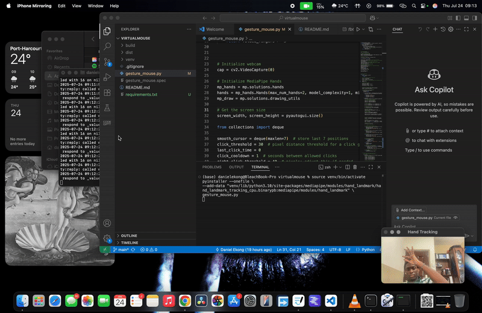

## 🖐️ Gesture-Controlled macOS Interface

Control your MacBook using hand gestures via webcam using **MediaPipe** + **OpenCV** + **PyAutoGUI**.  
Supports mouse control, clicks, scrolling, app switching, and macOS-specific shortcuts using two hands.

---

### ✨ Features

#### 👟️ **Right Hand (Mouse Control)**  
| Gesture                         | Action            |
|-------------------------------|-------------------|
| Move Index Finger              | Move Mouse Cursor |
| Index + Thumb Pinch            | Left Click        |
| Pinky + Thumb Tap              | Right Click       |
| Fist                           | Drag (Hold)       |
| Middle Finger Pinch (to Thumb) | Scroll Up         |
| Ring Finger Pinch (to Thumb)   | Scroll Down       |

#### 🎹 **Left Hand (macOS Shortcuts)**  
| Gesture                        | Action              |
|-------------------------------|---------------------|
| Index + Thumb Pinch           | Mission Control     |
| Full Fist                     | App Exposé          |
| Pinky + Thumb Pinch           | Minimize Window     |
| Peace Sign (index + middle up)| Spotlight Search     |
| 3-Finger Spread               | Next Desktop        |
| 3-Finger Pinch                | Previous Desktop    |

---

### 🛠️ Requirements

Install dependencies with:

```bash
pip install opencv-python mediapipe pyautogui numpy
```

---

### 📆 How to Run

```bash
python gesture_control.py
```

Make sure:
- Your **webcam is turned on**
- You're in a **well-lit environment**
- You have **macOS** (for macOS-specific shortcuts)
- Python 3.8+ recommended

---

### 🧠 Future Plans

- Gesture classification with ML
- Custom gesture training UI
- Windows/Linux support
- Voice + gesture fusion

---

### 🗅️ Recordings
 
> [Demo](demo.gif)

---

### 🧑‍💻 Author

Built with curiosity by **Daniel Ekong**  
Drop a ⭐ if you found this helpful!

